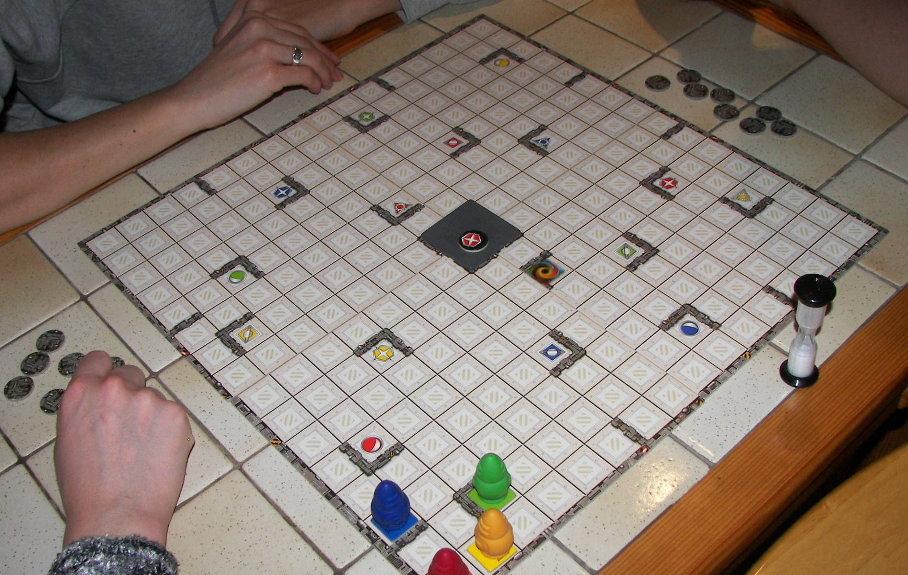
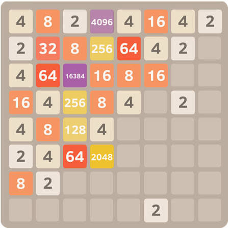
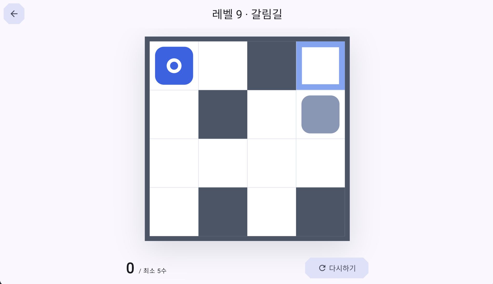
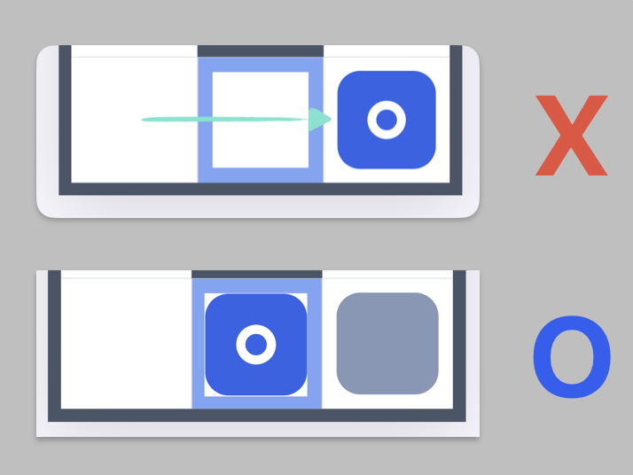

# 0. 데모 실행

### ▶ [blockrunner.izvillain.com](https://blockrunner.izvillain.com)

개발환경 세팅 없이 브라우저에서 바로 해보실 수 있습니다.

---

## 1. 게임 소개

한쪽 방향으로 이동을 시키면 판 위의 모든 블록들이 동시에 움직이는 퍼즐게임입니다.
그중 **플레이어 블록을 목표 지점에 정확히 멈춰 세우며** 레벨을 클리어를 해야 합니다.

### 아이디어

보드게임 **리코셰 로봇**과 모바일게임**2048** 에서 영감을 받아 
직접 문서나 코드 작성 없이 **99%** AI 바이브코딩으로 기획하고 개발했습니다. (**1%** 는 레벨 구성에 투자)



리코셰 로봇에서는 **이동과 목표**를 가져왔습니다. 조각이 무언가에 부딪힐 때까지 미끄러지고,
정해진 칸에 정확히 세워야 하며, 다른 조각이 그 받침대가 됩니다.



2048 에서는 **조작**을 가져왔습니다. 한 번의 입력이 판 위의 것을 하나가 아니라 전부 움직입니다.
대신 블록이 합쳐지는 규칙은 가져오지 않았습니다.

두 게임의 요소들을 가져와 새로운 형태의 퍼즐게임을 조합할 수 있었고,
생각보다 다채로운 난이도의 게임을 디자인할 수 있었습니다.

---

## 2. 플레이 방법



>아래의 조작법에 따라 모든 블록들은 같은 방향으로 동시에 움직입니다.
### 조작

| 무엇을            | 어떻게                                      |
| -------------- | ---------------------------------------- |
| 블록 이동 (PC · 웹) | **방향키** `↑ ↓ ← →` 또는 **`W` `A` `S` `D`** |
| 블록 이동 (마우스)    | 판 위를 **드래그**                             |
| 블록 이동 (모바일)    | 판 위를 **스와이프**                            |
| 다시하기           | 화면의 **다시하기** 버튼 또는 **`R`**               |

### 클리어 조건

목표 칸을 **지나가는 것으로는 안 됩니다.** 그 칸에 **멈춰야** 합니다.

 

플레이어가 목표지점에 멈출 수 없다면 "동료블록"을 발판으로 사용해야 합니다.

### 퍼즐 요소들


**주인공블록** - 판에 하나뿐이고, 이 블록을 목표에 세워야 합니다.


**동료블록** - 플레이어와 **같이** 미끄러집니다. 받침대로 활용하세요.


**목적지** - 주인공블록이 목적지 위에 서있으면 성공입니다.


**블랙홀** - 지나가는 무엇이든 빨려들어갑니다. 위험한 함정이지만, 적재적소 활용할 수도 있습니다.

---

## 3. 실행 방법

브라우저로 바로 해보시려면 위의 [데모 링크](https://blockrunner.izvillain.com)가 가장 빠릅니다.
직접 빌드해 보시려면 아래 두 방법 중 하나를 고르시면 됩니다.

### 방법 1. Docker — 준비물이 Docker 하나 (권장)

Flutter 를 설치하지 않아도 됩니다. 컨테이너 안에서 알아서 내려받아 빌드합니다.
[Docker Desktop](https://www.docker.com/products/docker-desktop/) 을 설치해 실행해 두시고,
내려받은 저장소 폴더에서:

```bash
docker compose up -d --build
```

브라우저에서 **http://localhost:7001** 을 열면 게임이 뜹니다. 끝낼 때는 `docker compose down`
입니다.

> [!warning] ⏱ 첫 실행은 10분 안팎 걸립니다
> 컨테이너가 Flutter SDK 를 내려받아 빌드하기 때문입니다. 두 번째부터는 즉시 뜹니다.

### 방법 2. Flutter 로 직접 실행

기기에 직접 띄워 보실 때 쓰는 방법입니다. Flutter 버전은 **3.44.8** 로 고정되어 있어
[FVM](https://fvm.app) 을 쓰는 것이 가장 간단합니다.

```bash
brew tap leoafarias/fvm && brew install fvm   # macOS
fvm install                                    # 3.44.8 을 내려받습니다
fvm flutter pub get
```

Flutter 를 직접 설치하셨다면 아래 명령에서 앞의 `fvm` 만 빼시면 됩니다.

| 어디서 볼까 | 명령 |
|---|---|
| **웹 브라우저** (가장 쉬움) | `fvm flutter run -d web-server --web-port=8080` |
| **macOS 앱** | `fvm flutter run -d macos` |
| **Windows 앱** | `fvm flutter run -d windows` |
| **Linux 앱** | `fvm flutter run -d linux` |
| **안드로이드 · 아이폰** | `fvm flutter run` |

> [!warning] 💡 웹은 `-d chrome` 을 쓰지 마세요
> 매번 빈 임시 브라우저로 열려서 언어 · 별점 · 해금이 저장되지 않는 것처럼 보입니다.
> 위 표의 `web-server` 명령으로 띄우고 평소 쓰시는 브라우저로 열면 됩니다.

---

## 4. 감사합니다

읽어 주셔서 감사합니다. 직접 해보시고 즐거우셨다면 좋겠습니다.
